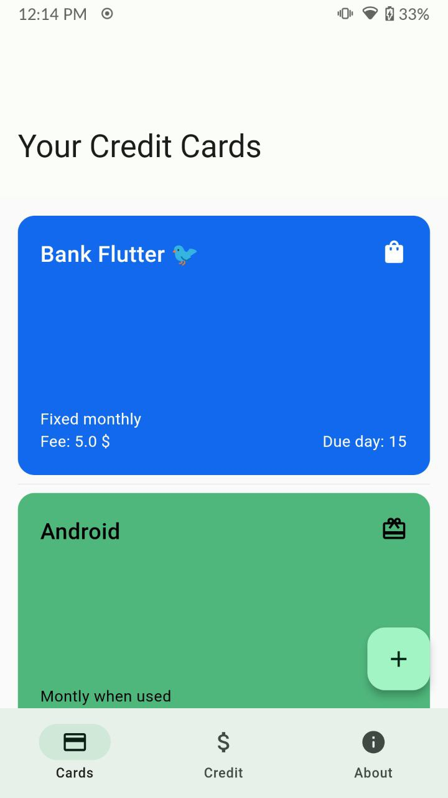
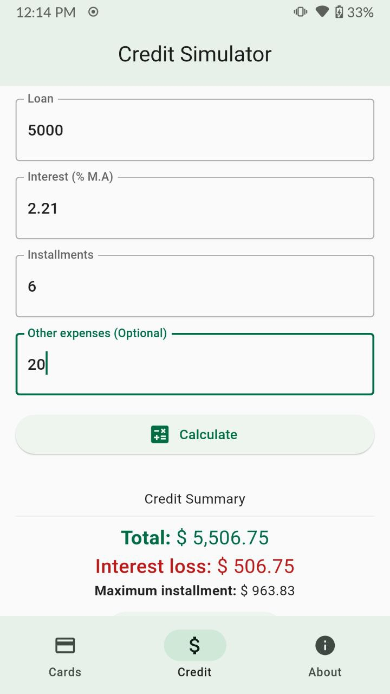
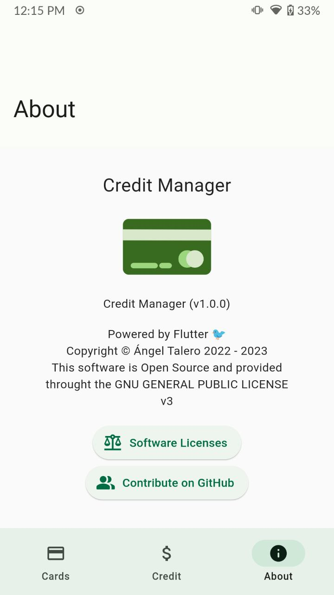
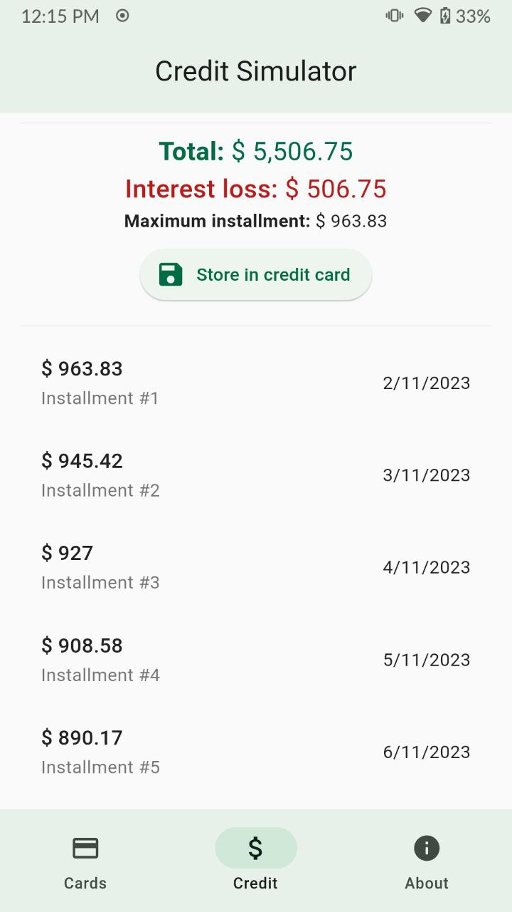
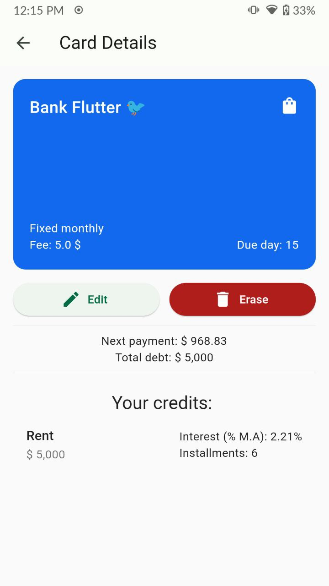
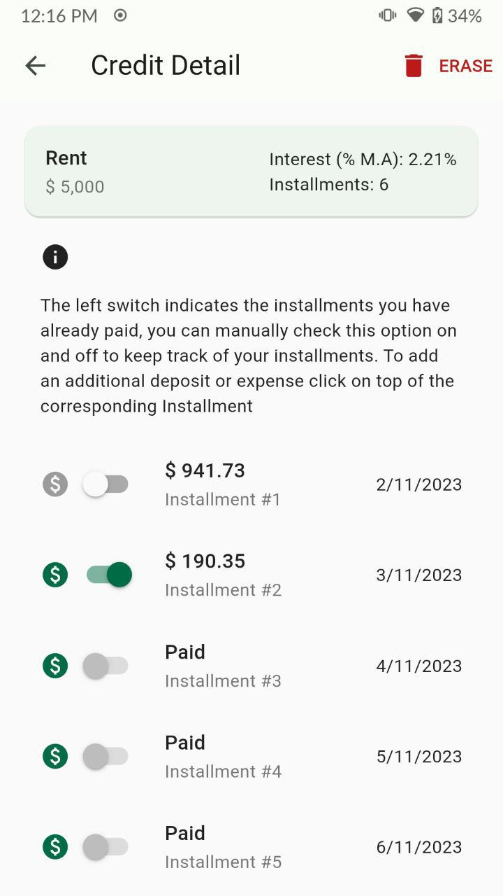

# 💳️ Credit Manager

Simple Flutter application for simulating credits and keeping track of your credit cards.

<a href="#"></a>

|                                                  |                                            |                                              |
| ------------------------------------------------ | ------------------------------------------ | -------------------------------------------- |
|              |       |          |
|  |  |  |

🌎️ Available in English and Spanish


## 🏗️ Compilation
The project is only available in 'Android' though no specific Android libraries where used so it may work in 'iOS' but I have no way of testing it.

In order to compile it you need to run the code generations:

```
flutter pub get
flutter pub slang build
flutter pub run build_runner build --delete-conflicting-outputs
flutter pub run flutter_native_splash:create
flutter pub run flutter_launcher_icons
```
Once generate you can watch for changes by running every one of these commands in separate command lines:
```
flutter pub slang watch
flutter pub run build_runner watch --delete-conflicting-outputs
```
## Release Build
In order to release build the app you need to run:

	flutter run --profile --cache-sksl --purge-persistent-cache 

use the app and open all of it's screens and then press 'M', this will generate a file called __flutter_01.sksl.json__

Now creating a _Release APK_ is done by using the following command:

	flutter build apk --obfuscate --split-debug-info=build/app/output/symbols --no-track-widget-creation --release --bundle-sksl-path flutter_01.sksl.json --no-tree-shake-icons -v
